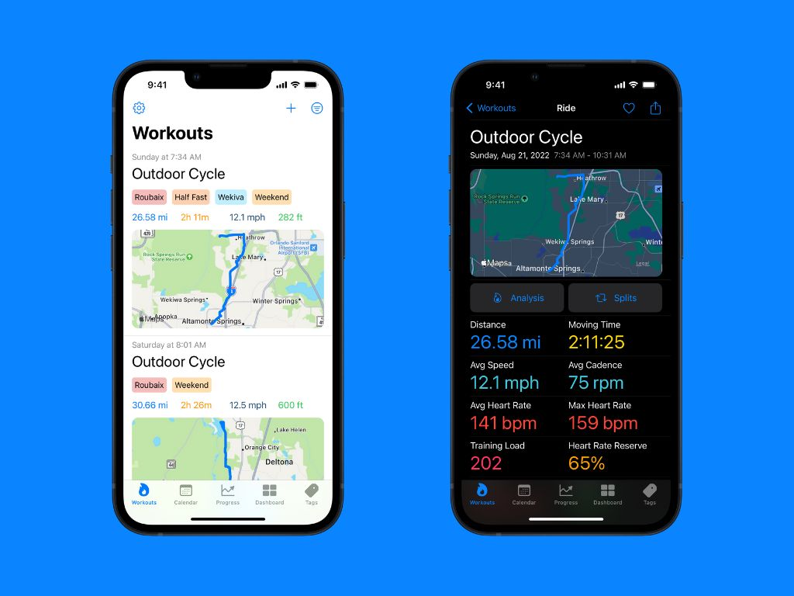

# Better Workouts - Advanced iOS Fitness Analytics App [ARCHIVED]

**⚠️ This project is archived and no longer maintained.**



A comprehensive iOS application for importing, analyzing, and tracking workout data from fitness devices. Built with SwiftUI and featuring deep HealthKit integration, this app demonstrates advanced iOS development patterns and sophisticated data processing capabilities.

## 🏃‍♂️ App Overview

**Better Workouts** is a premium fitness analytics application that transforms raw workout data from fitness devices (primarily Garmin) into meaningful insights. The app goes beyond basic fitness tracking by providing professional-grade analytics, heart rate zone analysis, training load calculations, and comprehensive workout management.

### Key Features

- **Advanced File Import System**: Import workout files (FIT format) from Garmin devices and other fitness equipment
- **Comprehensive Analytics Dashboard**: Health metrics with time-range filtering and visual summaries
- **Heart Rate Zone Analysis**: Professional training zones with TRIMP (Training Impulse) calculations
- **Interactive Maps**: Route visualization with elevation profiles and performance overlays
- **Smart Tagging System**: Organize workouts with intelligent categorization and filtering
- **Calendar Integration**: Timeline view with workout logging and progress tracking
- **HealthKit Synchronization**: Bidirectional sync with Apple Health for comprehensive health data
- **Training Load Analysis**: Scientific training load calculations based on heart rate variability
- **Cross-Device Sync**: CloudKit integration for seamless data synchronization

## 🛠 Technical Excellenceqq

This project showcases advanced iOS development techniques and architectural patterns suitable for enterprise-level applications.

### Architecture Highlights

#### **Modern SwiftUI + Core Data + CloudKit Stack**
- Environment-driven dependency injection with clean separation of concerns
- Core Data with CloudKit for robust offline-first data persistence
- Advanced Core Data schema versioning (5 migration versions)
- Custom NSValueTransformers for complex data type persistence

#### **Professional Data Processing Pipeline**
```
File Import → FIT Parser → Data Validation → Core Data → HealthKit Sync → Analytics
```
- **FitFileParser Integration**: Robust parsing of binary FIT files from fitness devices
- **Multi-threaded Processing**: Background processing for large workout files with progress tracking
- **Data Validation**: Comprehensive validation with detailed error states and user feedback
- **Memory Management**: Sophisticated caching system with automatic cleanup

#### **Advanced HealthKit Integration**
- **Bidirectional Synchronization**: Import and export workout data to/from Apple Health
- **Permission Management**: Granular health data permissions with graceful degradation
- **Training Load Calculations**: Scientific TRIMP calculations using heart rate zones
- **Heart Rate Analysis**: Zone-based analysis with customizable thresholds

### Key Technical Implementations

#### **Heart Rate Zone Processing**
```swift
// Advanced heart rate zone calculations with gender-specific TRIMP
struct TrainingLoadProcessor {
    // TRIMP = SUM(D x %HRR x 0.64e ^ y)
    // where y = %HRR x (1.92 for men, 1.67 for women)
}
```

#### **Concurrent Data Synchronization**
```swift
actor SynchronizerValues {
    // Thread-safe state management for background sync operations
    var isAuthorized = false
    var regenerate = false
}
```

#### **Custom Sports Classification**
- Support for 25+ sport types with specialized processing algorithms
- Sport-specific data extraction and analysis
- Intelligent activity type detection from imported data

### Performance & User Experience

#### **Sophisticated UI Components**
- **Interactive Maps**: MKMapView integration with custom annotations and overlays  
- **Responsive Design**: Adaptive layouts with dynamic type support
- **Dark Mode**: Full dark mode support with semantic colors

#### **Premium Features & Monetization**
- **StoreKit 2 Integration**: Modern in-app purchase implementation
- **Feature Gating**: Sophisticated feature availability based on subscription status

## 🔧 Technical Specifications

### Development Environment
- **Language**: Swift 5.x
- **Framework**: SwiftUI, UIKit (where needed)
- **Minimum Deployment**: iOS 14.0+
- **Xcode**: 15.0+ (latest tested)
- **Build System**: Xcode Build System with Fastlane automation

### Key Dependencies
- **FitFileParser**: Custom integration for Garmin FIT file processing
- **Core Data + CloudKit**: Apple's native persistence and sync solution
- **HealthKit**: Deep integration with Apple's health platform
- **StoreKit 2**: Modern in-app purchase implementation
- **MapKit**: Advanced mapping and location services

### Architecture Patterns
- **Dependency Injection**: Environment-based DI for testability
- **Repository Pattern**: Data access abstraction layers
- **Observer Pattern**: Reactive programming with Combine
- **Singleton Pattern**: Managed singletons for cross-cutting concerns

## 📱 Professional Development Practices

### Code Quality
- **Clean Architecture**: Clear separation between UI, business logic, and data layers
- **Error Handling**: Comprehensive error handling with user-friendly messages
- **Localization Ready**: NSLocalizedString implementation throughout
- **Type Safety**: Extensive use of Swift's type system for compile-time safety

## 🎯 Technical Expertise

This project demonstrates expertise in:

✅ **Complex Data Processing**: Multi-format file parsing and transformation
✅ **Apple Ecosystem Integration**: HealthKit, CloudKit, StoreKit mastery  
✅ **Performance Optimization**: Memory management and background processing
✅ **Modern iOS Architecture**: SwiftUI + Combine + Core Data patterns
✅ **User Experience Design**: Intuitive interfaces for complex data
✅ **Enterprise Patterns**: Scalable architecture suitable for team development
✅ **Third-party Integration**: Custom frameworks and external API handling
✅ **Premium App Development**: Subscription models and feature gating

## Screenshots

See the [Screenshots](./Screenshots) directory for additional app screenshots and interface examples.

---

*This project represents advanced iOS development capabilities suitable for enterprise consulting engagements. The codebase demonstrates production-ready patterns, sophisticated data processing, and deep Apple platform integration.*